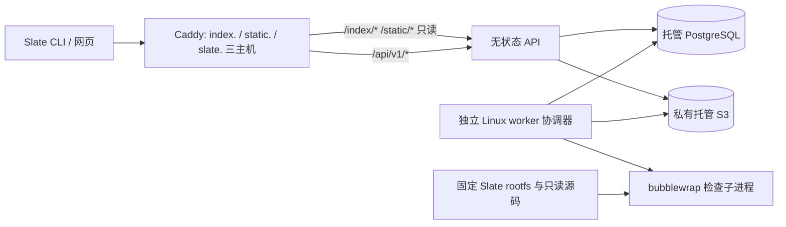

# Pebble 部署与运维

范围修订：用户后续明确完整 Git 托管为核心。现有部署资产仍只覆盖已实现的快照注册/API/worker；尚未配置 Git 存储节点、smart HTTP/SSH、发布 commit 保留、Git 备份与跨 SQL/Git 恢复。后续 Git 上线必须补齐并实际验收这些部分，不能直接把本文部署称为完整 Git Hub。

本目录提供可审阅、可执行的部署资产，并已完成真实 PostgreSQL、MinIO、HTTP 与 Slate 的本地联调及备份恢复演练。**尚未部署公网服务；当前执行环境没有 Docker socket 权限，容器构建/启动未在这里得到验证。** 本地结果不能替代目标生产环境验收。

2026-09-12 起服务实现 ADR-0188 协议（见 [注册发布协议](registry-protocol.md)）：公网由三个主机组成，`index.verifiable.ai` 提供稀疏索引，`static.verifiable.ai` 提供不可变归档与工具链，`slate.verifiable.ai` 提供 `/api/v1`。三者由同一个 API 进程服务，Caddy 按主机把请求改写到 `/index/`、`/static/` 与 `/api/v1/`；也可以让 CDN 直接读取对象存储的 `public/` 前缀。worker 的 rootfs 必须同时冻结 `slatec` 与 `slate`，因为它运行真实的 `slate check --release`。

本次已用官方 SHA256 核对的 Node v24.20.0 Linux x64 运行时完成类型检查、生产编译、协议/隔离/注册服务测试与 Rust HTTP 端到端验证。真实闭环包含三个正式发布，以及删除本地 provider 后由 Slate CLI 经网络下载依赖、检查并复用新定理；隔离测试另覆盖七项限制及超时处理，其中诊断程序不替代真实 Slate 检查。部署脚本、两份 Compose 和 systemd 单元通过静态校验，固定 rootfs 中的 bubblewrap 空输入拒绝探针也已运行。原始记录保存在 `.artifacts/node24-validation.log` 和对应 `registry-e2e-*/summary.json`。Node 24 **容器镜像**、systemd 服务实际启动、TLS 签发和公网负载尚未验收。

用户已确定 Pebble 是公网服务，首阶段目标为 1 万注册用户。托管平台、区域、域名、账户和费用授权仍待确定；本次没有创建外部资源或付费。容量假设与逐步扩展方法见 [容量目标](capacity.md)。

## 1. 部署结构与支持边界



API 与任务协调器是受控服务，持有各自所需的数据库/对象存储凭据。检查子进程只有固定 rootfs、只读输入和任务临时空间，通过空环境和独立网络命名空间隔离；它不读取宿主机凭据、数据库、S3 或其他任务缓存。worker 不挂 Docker socket，也不执行作者提供的部署脚本。

生产 API 使用 Node 24 LTS 容器。Node 官方建议生产使用 Active/Maintenance LTS；本次 Node 24 二进制测试覆盖应用运行时，部署目标仍需验收最终镜像。[Node 发布支持表](https://nodejs.org/en/about/previous-releases)。

当前 Slate rootfs 面向已经实际支持的 Linux x86_64 工具链。部署前核对目标架构及内核，不把可多架构拉取的 Node 镜像误认为 Slate 已支持 ARM。API 不执行 Slate，仅挂载 `toolchain.json` 与 `digest.txt`；worker 才需要全部 rootfs（`slatec`、`slate` 及其动态库），并在启动时校验清单及文件摘要，再以无参数运行 `/slate` 证明沙箱可用。

生产 worker 首选专用 Linux VM、非 root 用户和 [systemd 单元](../deployment/pebble-worker.service)。Bubblewrap 只是构造隔离的工具，安全性取决于真实参数和宿主内核。[Bubblewrap 官方说明](https://github.com/containers/bubblewrap)。Docker 默认 seccomp 阻止若干 namespace/mount 操作；不能因为容器无法运行 bwrap，就默认使用 `--privileged`、挂宿主根目录或关闭全部 seccomp。[Docker seccomp](https://docs.docker.com/engine/security/seccomp/)。

`Dockerfile` 也有 worker target，但只有在目标 OCI runtime 已支持所需的非特权 userns、seccomp 与 LSM 配置，且自检和隔离攻击测试通过后才启用。当前未提供未经验证的放宽过滤器。系统缺少 userns 支持或自检失败时停止接任务，不退回宿主执行。

## 2. 固定构建输入

`package-lock.json` 固定 npm 依赖，`deployment/tsconfig.build.json` 只把 `src/` 编译为 `dist/`；生产入口是 `node dist/main.js`，运行镜像不需要 tsx。

[pin-images.mjs](../deployment/pin-images.mjs) 从官方 Docker Registry 读取 manifest，校验响应摘要并从实际 bytes 计算镜像摘要，生成可审阅的 `images.lock.json` 和 Compose 用的 `images.env`。运行不需要 Docker daemon。**这是显式升级步骤**；日常重建从已审阅 lock 恢复环境文件，不每次自动选取更新。

```sh
node deployment/pin-images.mjs
node --input-type=module -e 'import fs from "node:fs"; const lock=JSON.parse(fs.readFileSync("deployment/images.lock.json","utf8")); fs.writeFileSync("deployment/images.env",Object.entries(lock.images).map(([key,value])=>`${key}=${value.reference}`).join("\n")+"\n");'
docker compose --env-file deployment/images.env --env-file deployment/local.env -f deployment/compose.yaml build api
```

第一条用于主动刷新；第二条用于从已有 lock 恢复。构建使用 `NODE_IMAGE=...@sha256:...`，没有可变 `latest` 默认值。生产把完成验收的 API 镜像推送到选定私有 registry 后，记录其实际 digest、代码提交、lock、迁移版本与 SBOM，再使用该 digest 部署；本次没有执行推送。worker 的 Debian 软件包也应随完成构建的最终镜像固定，升级时重新验收 bwrap。应用镜像与 Slate 工具链是独立身份，不能混用它们的摘要。

## 3. 本地完整运行

本节只绑定 loopback，不提供公网 TLS。需要有 Docker Compose 的本机，以及能够运行非特权 userns 的 Linux worker 环境。MinIO 使用固定归档版本，仅用来联调 S3 协议：官方仓库已归档，较新的安全 release 要求从源码构建，旧官方镜像不是长期公网存储建议。[MinIO 官方 releases](https://github.com/minio/minio/releases)。生产改用托管 S3。

先安装依赖并创建固定工具链目录；`--slatec` 与 `--slate` 必须指向同一次 Slate 构建的实际二进制（`check-workspace` 与 ADR-0188 客户端），不能指向旧工作树。输出目录须不存在。

```sh
npm ci
npm exec tsc -- -p deployment/tsconfig.build.json
node deployment/init-local.mjs
mkdir -p deployment/local
PEBBLE_TOOLCHAIN_TAG=local node dist/main.js toolchain --slatec /absolute/path/to/slatec --slate /absolute/path/to/slate --output deployment/local/toolchain
```

`init-local.mjs` 生成随机本地密码、一个固定 registry UUID 与 `PEBBLE_TOOLCHAIN_TAG=local`，不覆写既有文件。本地 `local-cli.mjs` 与 Compose 把三个根设为 `http://127.0.0.1:3000/index/`、`.../static/packages/...`、`.../api/v1`，客户端接受该 loopback 形式。`local.env`、临时数据和 secrets 已被 Git 忽略。工具链描述符、rootfs 文件清单及内容摘要由工具生成，不能复制示例 hash 或手工修补清单。

从已审阅 lock 恢复 `images.env`（见上节），依次启动依赖、初始化本地 bucket、迁移数据库、启动 API：

```sh
docker compose --env-file deployment/images.env --env-file deployment/local.env -f deployment/compose.yaml up -d postgres minio
docker compose --env-file deployment/images.env --env-file deployment/local.env -f deployment/compose.yaml build api
docker compose --env-file deployment/images.env --env-file deployment/local.env -f deployment/compose.yaml run --rm storage-init
docker compose --env-file deployment/images.env --env-file deployment/local.env -f deployment/compose.yaml run --rm migrate
docker compose --env-file deployment/images.env --env-file deployment/local.env -f deployment/compose.yaml up -d api
node deployment/local-cli.mjs provision --name local-researcher
node deployment/local-cli.mjs worker
```

`storage-init` 仅接受本地 MinIO 端点，创建 bucket 并附加只允许匿名读取 `public/*` 前缀的 bucket policy（`staging/` 保持私有）；生产 bucket 与其等价策略由运维单独创建，不在服务启动时自动执行。首次 MinIO 未就绪时可重试该步骤。`provision` 是运维 CLI，会输出新 token；保存到客户端私有配置，不贴进文档或日志。再次对同名 principal 执行可能轮换 token，不能把它当健康探针。

`local-cli.mjs` 从本地配置读取凭据，通过进程环境启动已编译服务，数据库和 S3 端点固定为 loopback。worker 需要单独终端或进程管理器。请求 `http://127.0.0.1:3000/health/live` 与 `/health/ready` 后，还应用真实 `slate publish` → worker 检查 → 审核发布 → `slate check` 消费的闭环验收（`npm run test:e2e` 就是这一闭环）；两个健康端点成功不代表此闭环成功。

停止本地服务使用同一 Compose 参数执行 `down`。不要在需要保留数据时使用 `down -v`；依赖镜像更换或清理临时目录不应顺带删除包数据。

### 邀请准入

新版本先运行 `migrate`，应用只读核对迁移 003，不会在启动时自动升级表；迁移 003 删除旧快照表并要求重新发布，不迁移旧数据。邀请由持有运维配置的操作者签发；普通账户没有签发权。`provision` 保留为测试引导及运维账户恢复工具，不作为用户注册端点，也不授予用户运维配置。

运维在已配置的本地环境执行以下命令，生成的文件包含秘密，只通过私有渠道交给被邀请者：

```sh
umask 077
mkdir -p .artifacts/invitations
node deployment/local-cli.mjs invite --name invited-researcher --expires-in-hours 168 > .artifacts/invitations/researcher.json
```

被邀请者在自己的机器上运行客户端（Linux/Node 24 已验收；其他系统的文件权限和持久化尚未验收）：

```sh
umask 077
mkdir -p ~/.config/pebble
node deployment/accept-invite.mjs --registry https://pebble.example --invite-file /private/path/researcher.json --output ~/.config/pebble/credentials.json
```

替换为实际已部署域名，本仓库尚未部署 `pebble.example`。输出只包含接受状态、账户 ID 和本地凭据路径，不打印邀请码或登录 token。凭据文件权限 0600，先持久保存再兑换；响应丢失时用相同文件重试，不能另生成 token。文件中的 `token` 通过私有运行环境提供为 Slate 客户端的 `SLATE_TOKEN`，不要写入研究清单、锁文件或仓库。客户端不会发送邮件或替用户转发邀请。

`node deployment/local-cli.mjs revoke-invite --id INVITATION_UUID` 撤销尚未使用的邀请码；已兑换账号的停用是另一项运维动作。兑换接口限 1 KiB 与每进程每 IP 5 次/分钟；这不是跨副本全局账户配额，邀请制也不取代累计存储、检查和出口预算。

## 4. 公网部署运行合同

生产环境固定同一个 `REGISTRY_ID`、工具链描述符和政策。副本重启不能生成新的 registry 身份，也不能各自覆写全局工具链/政策；升级由一次受控操作完成，过期候选继续绑定原输入并明确失效。

| 配置 | 作用 |
| --- | --- |
| `HOST=0.0.0.0`, `PORT=3000` | 容器监听；只由受控入口访问 |
| `DATABASE_URL`, `DB_POOL_SIZE` | 私网 PostgreSQL、TLS 验证及每进程连接预算 |
| `TRUST_PROXY_CIDRS` | 逗号分隔的受控代理地址/网段；未设时不信任转发头 |
| `REGISTRY_ID` | 首次部署生成并持久保留的 UUID |
| `PEBBLE_TOOLCHAIN_TAG` | 本注册表接受的唯一 Slate 工具链标签（如 `1.95.0`），与 worker rootfs 一起升级 |
| `PEBBLE_INDEX_ROOT`, `PEBBLE_DL_TEMPLATE`, `PEBBLE_API_ROOT` | 写入 `index/config.json` 与消费者锁文件的三个根；生产 Compose 由三个主机名推导 |
| `S3_BUCKET`, `S3_REGION` | 私有对象存储；生产 bucket 预先由运维创建 |
| `S3_ENDPOINT`, `S3_FORCE_PATH_STYLE` | 仅在兼容 S3 服务需要时设置并实际验收 |
| AWS 标准凭据链 | 优先 workload identity；否则从 secret manager 注入临时/轮换凭据 |
| `SLATE_ROOTFS` | 含描述符与 digest 的目录；worker 还包含固定 `rootfs/` |

填充 [API 环境示例](../deployment/production.api.env.example) 与 [worker 环境示例](../deployment/worker.env.example)。生产 env 文件权限为 0600，由部署系统或 root 写入，不进入镜像。数据库 CA 使用可验证的信任链；不得通过 `rejectUnauthorized=false` 或忽略 TLS 错误让连接变绿。

`compose.production.yaml` 是单宿主机便携配置，接入已经存在的托管 PostgreSQL/S3。通过其 Compose 环境提供 `PEBBLE_IMAGE`、`CADDY_IMAGE` 的固定 digest、`SLATE_TOOLCHAIN_DIR`、`PEBBLE_TOOLCHAIN_TAG`、三个主机名 `PEBBLE_INDEX_DOMAIN`/`PEBBLE_STATIC_DOMAIN`/`PEBBLE_API_DOMAIN` 与 `ACME_EMAIL`，将业务配置放到 `deployment/production.api.env`。它没有发布数据库或 MinIO 端口。三个主机的 DNS 都指向该宿主机；[Caddyfile](../deployment/Caddyfile) 对 index/static 主机只放行 GET/HEAD 并改写到 `/index{uri}`、`/static{uri}`，对 API 主机只放行 `/api/v1/*` 与 `/health/*`，请求体上限 96 MiB。

单机入口使用独立 bridge `172.30.0.0/24`，Caddy 固定为 `.2`、API 固定为 `.3`，API 只信任 Caddy 的 `/32`，且不向宿主发布 3000 端口。若与宿主/VPC 路由冲突，同时调整 `PEBBLE_PRIVATE_SUBNET`、`PEBBLE_EDGE_IP`、`PEBBLE_API_IP`。不要将无关容器加入这个网络。Caddy 默认重新生成受控转发头；其前方若再加入代理，必须另外核对整条受信链。[Caddy reverse_proxy](https://caddyserver.com/docs/caddyfile/directives/reverse_proxy)。托管负载均衡部署使用实际入口 CIDR 和防火墙限制，不能照搬单机私有地址，也不能设置为信任任意来源。

将 [Compose 环境示例](../deployment/production.compose.env.example) 和 API 环境示例复制为对应 `.env` 文件、设为 0600 并填入目标环境值。生产迁移由独立部署任务以运维凭据运行同一镜像的 `migrate` 命令，挂载相同的两个工具链描述文件；不要把迁移凭据长期写入 API 环境。完成迁移后才执行：

```sh
docker compose --env-file deployment/images.env --env-file deployment/production.compose.env -f deployment/compose.production.yaml pull
docker compose --env-file deployment/images.env --env-file deployment/production.compose.env -f deployment/compose.production.yaml up -d api edge
```

[deploy.sh](../deployment/deploy.sh) 把这一顺序封装为一次 ssh 部署：核对本地 `images.env`、`production.compose.env`（必须钉住 `PEBBLE_IMAGE` digest、设置三个主机与 `PEBBLE_TOOLCHAIN_TAG`）与 `production.api.env` 的存在及 0600 权限，用 `PEBBLE_DEPLOY_KEY` 通过 rsync 送到 `PEBBLE_DEPLOY_HOST:${PEBBLE_DEPLOY_DIR:-/opt/pebble/deploy}`，可选地 `docker save | docker load` 本地镜像（`PEBBLE_DEPLOY_IMAGE`）或在远端 `pull`，`PEBBLE_DEPLOY_MIGRATE=1` 时先运行一次 `migrate`，最后 `up -d api edge`。脚本不内置任何主机、凭据或镜像；`PEBBLE_DEPLOY_DRY_RUN=1` 只打印计划。本仓库尚未对任何主机执行它。

执行发布的顺序是：拉取经过验收的镜像 → 独立 `migrate` 一次 → 启动一个 API 并验证依赖、身份/政策 → 运行真实冒烟（`curl https://<api>/health/ready`、`curl https://<index>/config.json`，再用 `slate` 对一个临时包做真实发布）→ 切入流量。迁移与 `provision` 由单独运维身份执行，运行服务不需要 bucket admin 或数据库超级用户。当前应用与 SQL 实现的权限必须先在预生产实测，不能只创建不同名字的账号就声称做了最小权限。

选用该单机入口时，DNS 必须指向宿主机且 80/443 可达；Caddy 可自动获取/续期证书并跳转 HTTPS。持久保存 Caddy 数据卷，检查证书续期告警。[Caddy HTTPS](https://caddyserver.com/docs/automatic-https)。首阶段高可用方案使用两台 API 宿主机和托管 TLS 负载均衡，不能把单机 Compose 误报为高可用。

API 已设置请求体、超时、每进程并发及每 IP 请求频率上限，数据库还限制每账户/全局待处理任务；准确额度见 [容量文档](capacity.md#4-配额与背压)。入口仍需按部署目标配置连接数、上传速率和跨副本防滥用控制。Caddy 标准镜像没有在这里实现分布式账户限流；每账户小时额度与累计存储配额也尚未实现。

## 5. 专用 worker 安装

在目标 Linux 主机安装受支持 Node 24、bubblewrap 和 systemd。创建没有交互登录的 `pebble-worker` 系统用户；把编译后的应用、生产依赖、migrations 与 `deployment/worker-preflight.mjs` 作为同一个版本目录安装到 `/opt/pebble/releases/<revision>/`，由 root 管理 `/opt/pebble/current` 指向它。worker 用户不得写这些程序或工具链。

把通过校验的工具链安装到 `/opt/pebble/toolchains/<digest>/`，以 root 所有的 `current` 链接选择版本。应用本身验证 rootfs 文件；操作员另外核对该 digest 正是 registry 允许的工具链，不能仅凭任意自洽目录作出信任决定。为 `/var/lib/pebble-worker` 所在卷设置实际磁盘配额和告警；systemd 的单文件大小限制不等于整个临时目录配额。

安装 `deployment/pebble-worker.service` 到 systemd 单元目录，配置 `/etc/pebble/worker.env`（含与 API 相同的 `PEBBLE_TOOLCHAIN_TAG`）后执行 `systemctl daemon-reload` 与 `systemctl start pebble-worker`。单元通过非 root 用户、只读宿主系统、无额外 capabilities、独立临时目录与 cgroup CPU/内存/进程上限控制资源。每个单元先运行 [worker-preflight.mjs](../deployment/worker-preflight.mjs)：真正启动固定 rootfs 中的 `/slate`，要求它以用法错误退出；失败则不启动 worker。worker 每个任务把依赖闭包物化为 `file://` 镜像并在沙箱内运行 `slate check --release`，任务临时目录需要容纳依赖归档与 `.slate/` 缓存。

这个探针证明 rootfs 和 namespace 机制可运行，**不等同于完整隔离审计**。上线验收还应验证源目录不可写、检查进程看不到 DB/S3 凭据或宿主进程、不能出网、超时终止整个检查进程组、磁盘/内存耗尽不产生成功记录。限制 userns 的宿主 LSM 政策需要运维在专用 worker 范围内配置并测试，不能为所有系统用户关闭保护。

初期每个 worker 进程只执行一个任务。停机先停止领取任务，给已领取任务有限完成时间；达到 `TimeoutStopSec` 后 systemd 终止整个 control group，任务由租约/attempt 机制恢复。过期 worker 的回传不能覆盖新 attempt。监控心跳、最老任务等待、失败/超时和租约回收，不用“进程还活着”代表工作队列正常。

## 6. 备份、恢复与状态撤销

生产初始目标（尚未验收）：数据库 **RPO ≤ 5 分钟、RTO ≤ 60 分钟**；对象/证据备份 **RPO ≤ 24 小时、RTO ≤ 4 小时**。发布由数据库记录与实际对象共同组成，整体恢复承诺受两者较差者约束；不能只用 PostgreSQL 的 RPO 宣称整个研究成果库无损。

托管 PostgreSQL 启用连续 WAL/PITR、每日备份及至少 14 天可恢复窗口；每月在新实例恢复演练。独立逻辑导出用于迁移/额外保留，但 `pg_dump` 本身不提供 PITR。PostgreSQL 官方区分基础备份、WAL 与逻辑导出。[PostgreSQL PITR](https://www.postgresql.org/docs/17/continuous-archiving.html)。

已实现的 [backup.mjs](../deployment/backup.mjs) 由独立运维身份调用，使用 PostgreSQL 导出的同一个只读事务快照生成逻辑 dump、表计数、registry 配置和对象引用清单：`package_versions` 引用的 `public/packages/...` 归档与 `candidates` 引用的 `staging/...` 归档（同一摘要只保存一份文件）；随后流式复制并核对 SHA256 与长度。索引文件与 `config.json` 是派生数据，不进入备份，恢复后用 `reindex` 重建；`public/toolchains/` 由运维用 `toolchain-publish` 重新发布。只有全部完成才写最终 manifest；部分目录不算成功备份。该过程依赖对象不可变及保留政策，备份期间不得回收已引用对象。[pg_dump 快照选项](https://www.postgresql.org/docs/17/app-pgdump.html)。

备份环境注入 `DATABASE_URL`、源 `S3_BUCKET` 及标准 S3 配置；恢复使用独立的 `RESTORE_ADMIN_DATABASE_URL` 和目标 S3 凭据。连接密钥通过环境传递，不进入命令行。需要与服务器兼容的 `pg_dump`/`pg_restore`，可用 `--pg-bin` 指定目录；恢复脚本要求相同 PostgreSQL 主版本。默认 schema 是 `public`；测试的独立 schema 可显式指定。

```sh
node deployment/backup.mjs backup --archive /secure/backups/NEW_RUN
node deployment/backup.mjs restore --archive /secure/backups/NEW_RUN \
  --manifest-sha256 "$RETAINED_MANIFEST_SHA256" \
  --database pebble_recovery_new --bucket-prefix pebble-recovery --create-new-targets
```

恢复完成后，以恢复库与新 bucket 的配置运行 `node dist/main.js reindex` 重建索引树。备份输出的 `manifest_sha256` 必须独立留存在受控审计/备份目录中，不能恢复时只接受归档自带的 hash。恢复在创建任何资源前核对 manifest、dump 和全部对象；拒绝已存在的数据库，不提供覆写选项。目标 bucket 由前缀加随机 UUID 后缀生成，并预检不存在、逐对象条件写入，避免把 AWS `us-east-1` 对同属主既有 bucket 的成功响应误认为独占新建。[S3 CreateBucket](https://docs.aws.amazon.com/AmazonS3/latest/API/API_CreateBucket.html)。失败可能保留部分新目标，脚本不自动删除资源；操作员根据执行记录核对后处理。

**恢复库默认保持隔离。** 新建数据库后、还原旧数据之前立即 `REVOKE CONNECT ... FROM PUBLIC`，数据库仅由独立恢复管理员持有。禁止 API/worker 使用该管理员、超级用户或继承管理员权限的角色。脚本不会开放入口，也不会给业务角色授权。恢复完成后核对当前权限、token 撤销、邀请码消费/撤销和验证撤销审计，再由运维明确授予业务角色 CONNECT 及所需 schema/table 最小权限；`--no-owner --no-acl` 会使还原对象归恢复管理员，不能只授 CONNECT 就假设服务可用。缺少独立撤销记录时，受影响内容继续拒绝访问。历史公开记录不能直接恢复成当前公开权限。

恢复验证会再次读取新 bucket 的所有对象核对摘要/长度，并与 dump 的表计数、对象引用、工具链/政策、原 snapshot/report 摘要以及存储 JSON 的完整性 hash 比较。JSON 完整性 hash 仅用于备份比对，不是新的定理身份或数学接受证据。工具链、运行配置、密钥恢复方式也要单独备份；SQL 数据不包含它们的可运行替代品。备份包含私有研究元数据，目录使用 0700、文件使用 0600，并须在生产加密、隔离保管；当前脚本本身不实现密钥托管或加密；清单限 32 MiB，超限拒绝完成备份，更大库存需采用生产备份方案并单独验收。

2026-09-12 迁移到 ADR-0188 协议后，在本地 PostgreSQL 17 与 MinIO 上再次演练：真实 `slate` 客户端生成的 `base 0.1.0` 经 worker 检查并由维护者发布后，`backup.mjs backup` 记录 4 个引用键（2 份不同归档，6,034 bytes），`restore` 到新库与新 bucket 并核验通过，`reindex` 重建的索引文件与原索引逐字节相同；结果保存在 `.artifacts/backup-drill-2026-09-13T00-57-20-288Z/drill-result.json`。恢复库同样保持 CONNECT 撤销。此前 2026-09-09 的旧协议演练记录如下，仅作历史参考：在本地 PostgreSQL 17 与 MinIO 的实际演练使用 10,000 个真实 principal，以及经真实 Slate worker 检查、HTTP 发布的代数包：16 张表、3 个对象共 13,858 bytes、1 个快照和 1 份报告；包内包含 LICENSE.txt，恢复后实际核对 Apache-2.0 及 Slate 上游贡献者署名。Node v24.20.0 下最终备份 112 ms、恢复和核验 148 ms。普通业务角色 `pebble_test` 连接新库返回 SQLSTATE `42501`；重复目标数据库被拒绝；篡改备份对象在创建目标前被拒绝。这是小数据本地演练，不能作为生产 RTO。证据位于 `deployment/backups/final-validation.json`；自建恢复库均保持 CONNECT 撤销，对应私有测试 bucket/归档保留供本地复查，名称由证据文件记录，未修改原服务库。

S3 bucket 开启版本保留，应用身份不给 `DeleteObjectVersion`。独立备份账号保存副本/恢复点，生命周期先保留非当前版本至少 30 天，不自动清理仍被正式版本或证据引用的对象。版本保留可恢复误删/覆写，但不是应用不可变约束的替代品。[S3 Versioning](https://docs.aws.amazon.com/AmazonS3/latest/userguide/Versioning.html)。bucket 与账号级 Block Public Access 保持开启；公开研究也通过受控 API/授权分发路径读取，而不是把整个 bucket 设为公开。[S3 Block Public Access](https://docs.aws.amazon.com/AmazonS3/latest/userguide/access-control-block-public-access.html)。

恢复过程中保持入口关闭。按数据库引用清单找回精确对象版本并重新算摘要；缺对象的检查/发布保持不可用，不捏造报告补齐。恢复到历史数据库可能回滚撤权/验证撤销状态，因此开放流量前需重放可独立保留的撤销审计或对受影响对象保持拒绝读取，完成核对后再开放。不可变内容恢复不自动恢复读取授权。

## 7. 迁移、升级、回滚与监控

迁移由一次运维任务执行，先完成备份及兼容性检查。优先采用先扩字段/新表、双版本应用都能读取、完成迁移后再删除旧结构的过程。回滚通常切回上一份已经验收的应用镜像；破坏性 schema 变更不能靠回滚镜像撤销，必须前向修复或恢复到新实例，随后做完整状态核对。

升级 Slate 或政策产生新的 digest。新旧检查任务各自绑定自己的工具链/政策，不能把候选输入换成新版本后保留旧“通过”身份。先准备新 rootfs、实测支持与拒绝样例、部署新 worker，再按受控流程更新 registry 允许的配置。工具链或关键内核问题的验证撤销属于附加状态，不能删除证据或改写包版本。

最低监控包括：入口状态码/延迟/限流；API CPU、RSS、事件循环、连接池；数据库连接、事务重试、锁等待、WAL/磁盘与备份年龄；S3 请求错误、摘要冲突、存储/流量与备份落后；worker 租约、队列年龄、耗时、资源耗尽和结构化报告错误；TLS 证书、工具链/政策不一致和撤销审计。

`/health/live` 用于进程存活，`/health/ready` 用于摘流判断；另外监测对象存储与一次完整业务探针。依赖不可用时不要用频繁重启制造雪崩。日志保留请求/任务/attempt ID 和操作结果，避免 token、数据库 URL、完整私有源码或未授权报告内容。告警应有处理人和恢复步骤，阈值由真实基线调整。

每次发布记录确切代码/镜像/rootfs/政策/迁移版本、执行者、时间、验证结果和回滚落点。本次已完成本地真实联调、隔离测试及小数据备份恢复；生产容器运行、TLS、托管 PITR/版本恢复、故障切换和公网 SLO 仍需在选定部署目标验收。

## 8. 单机 Cloudflare Tunnel 部署与迁移

2026-09-12 首个实际部署形态：一台临时 Linux 主机，无入向端口，三个主机名由 Cloudflare Tunnel 接到本机。设计目标是**迁移友好**：所有状态都是普通目录，换机器等于停服务、拷目录、起服务，域名与注册表身份不变。

| 部件 | 位置 | 说明 |
| --- | --- | --- |
| PostgreSQL、MinIO、API、Caddy edge | `deployment/compose.tunnel.yaml` | edge 只监听 `127.0.0.1:${PEBBLE_EDGE_PORT}`（HTTP），按 Host 把 `index.`/`static.`/`slate.` 三个域名重写到 API 的 `/index`、`/static`、`/api/v1` 前缀；真实客户端地址取 `CF-Connecting-IP` |
| 全部状态 | `${PEBBLE_STATE_DIR}/postgres`、`${PEBBLE_STATE_DIR}/minio` | bind mount 的普通目录，没有 named volume；MinIO 数据里就是公开索引与归档树 |
| 配置与秘密 | `deployment/tunnel.env`（0600，被 Git 忽略） | 数据库/MinIO 口令、`REGISTRY_ID`、`PEBBLE_TOOLCHAIN_TAG`、三个域名、状态目录 |
| 隧道 | `/etc/cloudflared/config.yml` + `<tunnel-id>.json` | 由 `deployment/tunnel-setup.sh` 从 `cloudflared.yml` 模板生成并安装为 systemd 服务 |
| worker | `/opt/pebble/current`、`/opt/pebble/toolchains/current`、`/etc/pebble/worker.env`、`pebble-worker.service` | `deployment/worker-install.sh` 幂等安装；单元允许 `AF_NETLINK` 且不启用 `ProtectKernelTunables/Logs/ControlGroups`，否则 bubblewrap 无法在沙箱里挂 `/proc` |

镜像：MinIO 已从 Docker Hub 下架，`images.env` 改为 `quay.io/minio/minio@<同一 digest>`。

首次部署顺序（`deployment/` 目录内，`C` 为 `docker compose --env-file images.env --env-file tunnel.env -f compose.tunnel.yaml`）：

```sh
node dist/main.js toolchain --slatec SLATEC --slate SLATE --output local/toolchain-<tag>   # 与 tunnel.env 的 SLATE_TOOLCHAIN_DIR 一致
$C build api && $C up -d postgres minio && $C run --rm storage-init && $C run --rm migrate && $C up -d api edge
$C run --rm migrate provision --name OWNER --grant                   # 一次性打印 token；存到私有位置
$C run --rm -v SLATEC:/mnt/slatec:ro -v TOOLCHAIN.lock:/mnt/TOOLCHAIN.lock:ro migrate toolchain-publish --tag <tag> --host x86_64-linux --slatec /mnt/slatec --lock /mnt/TOOLCHAIN.lock
./worker-install.sh
cloudflared tunnel login && ./tunnel-setup.sh                        # 需要拥有域名的 Cloudflare 账号在浏览器里授权一次
```

一次性运维命令用 `migrate` 服务承载（它没有固定 IP，`api` 服务有）。冒烟：`curl https://slate.verifiable.ai/health/ready`、`curl https://index.verifiable.ai/config.json`，再用 `slate publish` 发一个真实包并观察 worker 日志。

迁移：旧机器 `deployment/host-export.sh /path/pebble.tar.zst`（停服务、打包状态目录 + `tunnel.env` + 工具链 + `/etc/cloudflared` + `/etc/pebble/worker.env`，再拉起），新机器同一 commit 的仓库里 `deployment/host-import.sh /path/pebble.tar.zst` 然后 `worker-install.sh`。隧道凭据随包迁走，DNS 不用改；旧机器停掉 cloudflared 即完成切换。日常备份仍用 `backup.mjs`（逻辑 dump，可在不停机时做）。
