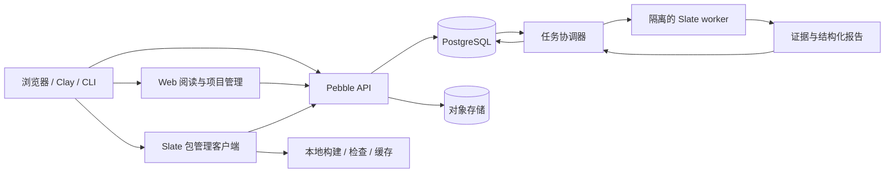

# Pebble 技术研究与实现方案

记录：TECH-0001；状态：proposed；研究日期：2026-09-08。

本方案细化 [产品设计](product-architecture.md)。外部组件能力来自所链接的官方资料；选型、接口和资源目标是 Pebble 的建议。尚未部署服务或完成端到端验证。Slate 的具体核查与包协议见 [包管理及验证边界](package-verification.md)。

产品边界：写作编辑器与实时共同编辑归 Clay；Pebble 提前设计接入接口，自身不提供这些功能。本期核心是 Cargo 式本地包工作流、注册/验证发布，以及 GitHub 风格的包浏览。下面完整 Git 托管、PR、社交和训练相关内容作为后续研究保留，不是首发依赖。

## 1. 建议技术组合

| 部分 | 建议 | 原因与替代方案 |
| --- | --- | --- |
| Web | TypeScript、React、Next.js | 论文/结果页服务端渲染，搜索、引用与项目管理提供客户端交互；纯 SPA 可行，但需额外处理公开阅读页渲染 |
| 应用 API | TypeScript、Fastify，模块化单体 | Web、CLI、Clay 共用明确 HTTP API；业务授权和发布事务只在这里实现，不在 Next Server Actions 再写一套 |
| 数据 | PostgreSQL、显式 SQL migrations | 关系、唯一性和发布事务是主要需求；证明 DAG 原始体不塞进关系表 |
| 源码 | 上传的不可变包快照 + 可选外部 Git 来源 | 首发从包快照生成源码树；完整 Git 服务作为后续独立选型 |
| 文件 | S3 API 对象存储 | 保存包源码、证据、论文和数据；后续自托管 Git 使用独立持久卷 |
| 检索 | PostgreSQL 全文索引、精确标识索引 | 先测结果检索质量与权限过滤；语义向量搜索增量加入，不直接上独立图数据库 |
| 异步执行 | PostgreSQL job/outbox 表 + 独立 worker | 发布状态与入队可在一次事务中提交；目前没有引入 Kafka/Temporal 的已测需求 |
| 验证执行 | 固定 Slate 工具链镜像、隔离 worker | 验证进程不能持有项目写权限、发布凭据或模型 API key |

Next 支持服务端与客户端组件分工；Fastify 提供 schema 验证/序列化，但其 schema 必须来自服务端受控代码，不能把用户提交的 schema 动态编译执行。[Next 文档](https://nextjs.org/docs/app/getting-started/server-and-client-components)、[Fastify 文档](https://fastify.dev/docs/latest/Reference/Validation-and-Serialization/)。

这是基于产品需求的选型推论，不是性能排名。Rust 留在 Slate 客户端和检查器；网页业务首版不增加第二套 Rust API 服务。各具体依赖版本在脚手架阶段按兼容性测试锁定，不把文档中滚动的 latest 当部署版本。



逻辑模块不等于独立微服务。Web、API、任务协调器可来自同一 TypeScript workspace；验证独立运行以隔离用户内容；完整 Git 服务不在首发部署图内。

建议仓库布局如下，当前只创建了设计文档和有限实验，尚未创建这些应用目录：

```text
apps/web/                  页面、阅读与项目管理
apps/api/                  身份、项目、协作、注册、发布等业务模块
apps/worker/               任务协调、索引与导出
packages/api-contracts/    单一 API schema 与生成客户端的输入
infra/                     部署、隔离执行配置与恢复流程
```

目录边界不是要求各建一个微服务。数据库迁移由 API 所属应用统一管理，禁止 worker 或页面直接引入各自版本的发布规则。

## 2. Git 托管：后续研究，不阻塞包注册首发

本期不需要自己提供 clone/push。源码页从已发布包清单及其 blobs 构建，仓库 URL 和 commit 是可选来源元数据。以下设计仅在决定建设完整 Git 托管时启用；Git 风格界面本身不要求 Forgejo 或自建 Git 服务。

### 方案比较

| 路线 | 能复用 | Pebble 必须额外承担 | 结论 |
| --- | --- | --- | --- |
| GitHub 托管用户研究 | Git、PR、身份生态 | 外部可用性/权限依赖、平台访问与研究记录权限映射 | 支持导入或镜像，不作为唯一研究存储 |
| Forgejo 作完整底座 | Git、议题、PR、账户、API | 两套产品对象/权限/事务的同步，或长期维护 UI/服务分叉 | 认真保留为备选，未做部署比较，不宣称它不能满足 |
| 原生 Git 服务 + Pebble 数据模型 | Git 传输、对象、diff、merge、ref 事务 | 托管运维、分支保护、审阅、权限、限额、备份均由我们负责 | 后续托管候选，待完整项目审阅需求明确后比较 |

Forgejo 提供 REST API 和实例 OpenAPI 文档，适合做有限适配；API 存在本身不保证 Pebble 的跨系统发布原子性。原生 `git-http-backend` 提供 fetch/push HTTP 协议，认证授权仍需服务器负责。[Forgejo API](https://forgejo.org/docs/latest/user/api-usage/)、[Git HTTP backend](https://git-scm.com/docs/git-http-backend)。

在进入完整托管实现前做一个有退出条件的比较：同样演示私有项目 clone/push、撤权、受保护分支、成果提交、结果审阅链接和恢复备份。若 Forgejo 适配在不分叉内核、不复制授权真相的情况下显著减少维护，则替换 Git 服务建议；不要同时生产运行两套托管后端。

### 数据与协议

每个项目一个 bare repository，以不可变 `project_id` 定位磁盘目录；用户输入的 owner/slug 只查映射，不能拼进文件路径或 shell。对象读取使用 `git cat-file --batch`，树枚举用 `git ls-tree -z`，避免每个文件启动一个进程；所有 Git 子进程用固定 argv、受控环境和超时。

HTTP gateway 校验短期/可撤销 token，生成绑定 project、操作、权限修订和请求 ID 的内部授权。Git backend 不公开监听，只接收受控 gateway 的请求；仓库级读权限作用于整个对象库。push 在平台控制的 receive hook 再检查权限和保护规则；禁止用户安装服务器 hook，用户仓库内的文件不成为 hook。导入 URL 的网络访问与构建隔离，限制协议、重定向和内网地址。

**不支持公开项目的“私有分支”。** Git 官方明确指出 namespace 不是读取权限隔离边界。私有研究应放另一个私有项目/仓库；公开对话也不靠隐藏 Git ref 实现。公开发布可来自私有项目，但只导出明确选定的发布内容，不公开 Git 历史或研究记录。[Git namespace 安全说明](https://git-scm.com/docs/gitnamespaces)。

平台发起的 Git 变更（如合并 PR）必须携带 `expected_head`。服务端生成新 tree/commit 后，以 `git update-ref REF NEW OLD` 比较并更新；过期 head 返回冲突，不覆盖新提交。PR 审阅绑定 `base_oid`、`head_oid` 和候选合并树，目标分支变化时使旧合并检查失效。[Git ref 更新](https://git-scm.com/docs/git-update-ref)。

Git 与 SQL 无共同事务：先建立含 operation ID 的 SQL 操作记录，Git 侧更新目标 ref 并记录操作完成标识，再由幂等 reconciler 完成 SQL 投影。系统不得在 ref 更新成功、SQL 写入失败后再次无条件提交。发布固定候选 ref 及内容包；分支移动、删除不会改变已选候选。Git 内多个 ref 可事务更新，但这不解决 Git/SQL 的跨存储原子性。

### 已做的有限实验

[`experiments/git_snapshot.py`](../experiments/git_snapshot.py) 用临时 bare repository 检查三项真实 Git 行为：过期 head 的写入拒绝、候选 ref 不随分支移动、失败多 ref 事务没有部分更新。它不测试 HTTP、授权、SQL、论文展示或网络并发；结果不能替代托管集成测试。

2026-09-08 本地以 Git 2.51.0 运行，三项检查均通过。可用 `python3 experiments/git_snapshot.py` 重现；临时仓库自动清理，不连接远程。

## 3. 论文提交、阅读与版本关联

论文由外部工具产出，通过 Git 文件或上传附件进入项目。首版建议接受 PDF 和 Markdown：PDF 提供阅读/下载，Markdown 安全渲染公式和链接；不要求平台支持可逆编辑格式或多人草稿。

上传附件先进入 staging，经类型、长度和摘要检查后形成不可变对象。论文记录绑定项目、文件/对象摘要及关联修订；正式发布绑定该记录。上传新版创建新记录，不替换旧发布引用的文件。Markdown 所需图片等资源也固定内容摘要，不能依赖会变动的远程文件完成发布阅读。

论文与结果的关联在发布元数据中保存精确 package/release/declaration binding，结果页提供可复制引用。自然语言与形式化命题是否忠实对应独立审阅，不能从显示公式自动推断证明成立。无需通过自建文稿编辑器插入引用。

Markdown/HTML 渲染清理不可信内容，不执行用户 MDX/JavaScript；附件与登录应用隔离。当前不提供 LaTeX 在线编译或 PDF 生成流水线，作者提交生成好的 PDF。项目审阅评论绑定固定 commit、文件及范围，内容改变后标记过期。

写作编辑器、CRDT、WebSocket 共同编辑、离线草稿同步及 Git/实时草稿合并由 Clay 决定和实现。Pebble 不预建这些服务或数据表，但现在就明确下面的接入契约。

### Clay 接入准备：共用成果协议，独立写作状态

这里是当前需要设计的协议边界，不代表接口已经实现，也不要求先启动 Clay 项目。

| Pebble 提前准备 | Clay 如何使用 | 边界 |
| --- | --- | --- |
| 稳定 project/package/result/revision ID | 在 Clay 打开项目、选依赖并插入精确引用 | 不用网页 URL slug 或临时文件路径代替身份 |
| 客户端授权、项目权限与能力查询 | 代表用户读取项目、提交快照、请求检查 | 与 Web/CLI 同权；能写项目不自动能发布 |
| 不可变成果快照提交 | 将论文、代码、数据引用作为一个固定成果版本交给 Pebble | 返回 revision ID 与内容摘要；不接收光标、击键或 CRDT updates |
| 基线版本与幂等键 | 提交携带 expected revision，冲突后由 Clay 决定如何处理 | Pebble 拒绝静默覆盖；合并在线草稿不是 Pebble 职责 |
| 结构化结果与引用查询 | 获取声明、假设、作者、精确版本和引用信息 | Clay 编辑器如何呈现/插入由 Clay 决定 |
| 检查/发布任务查询 | 在 Clay 发起检查，读取诊断、精确绑定和发布进度 | 提交快照不自动发布，客户端不能自报已验证 |

优先复用现有拟议的包快照上传、release candidate 和结果 API，补充 project revision 查询/提交与权限查询。发布候选仍绑定精确快照；平台即使没有 Git 托管，也能接收 Clay 提交的成果。接口使用公开版本化 schema，论文资源格式可声明媒体类型，不绑定某一种编辑器内部文档树。

Clay 的草稿、实时会话和研究记录是不同对象。若以后接入研究记录贡献，走有独立公开/训练选择的记录 API，不能因提交论文快照而顺带上传对话或实时编辑历史。平台提供研究讨论不意味着承担 Clay 的共同写作。

首个 API 集成验收可由普通客户端完成：读取精确项目版本 → 在外部修改 → 提交固定快照 → 获取检查结果 → 授权发布；同时检查过期基线、撤权和重复请求。这个验收验证 Pebble 已为 Clay 做好接入准备，不需要实现任何编辑器。

## 4. 数据模型与事务约束

以下是完整方向的逻辑表，不是已经执行的 migration。首发优先 principals、包归属/权限、packages、package_versions、release_candidates、releases、verification、dependency、results、jobs/outbox 及下载对象记录；Git operations、PR、社交、竞赛和训练表随对应功能另行引入。大对象以摘要引用存储，授权判断依靠关系表。

| 表 | 主要字段与关键约束 |
| --- | --- |
| `principals`, `external_identities` | 用户/组织稳定 ID；外部身份唯一 `(issuer, subject)`，邮箱不作为唯一身份凭据 |
| `projects`, `memberships` | project ID、slug、visibility、ACL revision；唯一 `(project_id, principal_id)` |
| `repositories`, `git_operations` | project→repo 映射，Git 操作 ID、expected/new OID、状态 |
| `papers`, `paper_revisions` | 外部论文文件、对象摘要、关联修订和发布绑定；版本不可覆写 |
| `packages`, `package_versions` | 稳定 package ID、owner、slug；唯一 `(package_id, version)`，正式内容不可 UPDATE |
| `release_candidates`, `releases` | 固定修订、包集合、manifest digest、审核记录、状态修订 |
| `verification_runs`, `verification_results` | input digest、工具链/政策、attempt、状态、报告对象；结果按精确声明绑定 |
| `results`, `result_revisions` | 人类延续性 result ID；精确版本声明/命题/闭包身份；跨版本关联由作者提出并可审阅 |
| `research_cards`, `contribution_attributions` | 版本绑定的问题/贡献说明、原结果作者、形式化者和维护者；区分作者陈述与工具链导出字段 |
| `collections`, `collection_items`（后续） | 作者整理的有序成果/包/结果引用及说明；不承担依赖解析或验证权威 |
| `dependency_edges`, `citations` | 前者绑定包/模块/声明实际依赖；后者保存科学引用；不混成一种边 |
| `issues`, `pull_requests`, `reviews`, `comments` | 固定审阅修订和目标对象，正文可编辑并留历史 |
| `follows`, `bookmarks`, `activity_events`, `notifications` | 唯一关注关系、幂等事件 ID、每用户读取状态 |
| `research_records`, `source_permissions`, `training_choices` | 记录/片段来源、权利及选择的生效时间，不继承 Git 的公开权限 |
| `dataset_exports`, `export_items`, `evaluation_exclusions` | 导出清单、每项授权快照、问题族排除及撤销状态 |
| `challenges`, `submissions`, `contribution_credits` | 固定问题/validator 修订、用途隔离、提交来源与验证状态；署名不只限获胜者 |
| `jobs`, `outbox_events`, `idempotency_keys` | 任务租约/attempt、投递标记、作用域内请求摘要与返回结果 |

包注册命名允许 `@owner/name`，底层稳定 ID 不随组织转移改变。发布版本先禁止 build metadata，避免同一 SemVer 排序位置却有两个身份；预发布版本仅显式选择。不同包导出同一 Slate ModuleId 是否可共存由精确图检查决定，不由名称表单检查决定。

发布事务锁定候选和涉及的 package 行，复查内容摘要、当前发布者权限、检查/审核绑定、依赖撤销状态及当前政策；插入所有 package_versions、release 与 outbox 后一次提交。任何一个包版本冲突则整个发布不生效。发布者撤权、包转移和政策更新也使用相同的版本/锁协议，避免检查与提交之间更换授权。

只支持追加撤回/验证撤销事件，不修改已发布内容。对象存储准备成功但数据库失败的对象是不可见孤儿，按保留期回收；数据库不得先发布再慢慢上传证据。

## 5. 任务执行与验证吞吐

`jobs` 记录 `kind, input_digest, attempt, lease_owner, lease_until, available_at, state`。Worker 用短事务领取任务，执行过程中续租，不持数据库锁。PostgreSQL 的 `FOR UPDATE SKIP LOCKED` 适合多消费者队列表，但它返回不一致视图，不应用于证明“所有发布检查齐备”。[PostgreSQL SELECT](https://www.postgresql.org/docs/current/sql-select.html)。

任务语义是至少一次；回传必须匹配当前 attempt/租约和 input digest。过期 worker 的成功不能覆盖新结果。Outbox 投递、索引和通知按 event ID 去重。重试政策区分基础设施错误、超时和确定性检查失败；超时不能投影成数学反例。

验证流水线分为受控准备、隔离构建/检查、结果收集及提交。下载由准备阶段按锁文件完成，执行阶段默认无网络；供应只读源码/依赖/工具链，独立临时空间，限制 CPU、内存、磁盘、进程和输出体积。禁止挂 Docker socket、宿主凭据和共享可写信任缓存。

推荐首先测试 gVisor 下的现有 Slate 工具链与 filesystem/process 调用；若存在不支持的调用或隔离/吞吐不达标，再测试 Firecracker microVM。前者提供用户态应用内核隔离，后者采用基于 KVM 的 microVM；这些机制不产生数学证据，也不保证所有工具都能直接运行。[gVisor 架构](https://gvisor.dev/docs/architecture_guide/intro/)、[Firecracker](https://firecracker-microvm.github.io/)。

分离不可信 producer 与决定接受的受控检查进程。用户能在同一可写身份下运行任意代码时，即使检查器本身正确，也不能让该身份写检查完成记录或注入 stdout。发布凭据只在协调器；它接受绑定当前任务的受控报告，不接受作者上传的同形 JSON。

容量先按假设算，再实测：若每天 1,000 次检查、平均每次消耗 600 CPU 秒，平均需求约 `1000×600/86400 = 6.94` 核；按 50% 利用率约 14 核。这个数不含尖峰、内存、I/O、重试和不可并行部分，不是机器采购结论。记录排队/准备/检查/存储分别耗时以及峰值 RSS，按实际长尾调并发，不能只看任务数。

## 6. 搜索、引用与社交数据流

索引单位是项目、论文和精确结果三个层次。结果文档包含标题、作者、领域、自然语言说明、声明词项、符号/定义 ID、理论及假设摘要、包版本、当前验证状态。依赖邻接表用于“哪些结果依赖它”，点击展开逐页查，不预先保存所有路径。全图巡检按节点与边去重，避免菱形依赖指数展开。

先用精确 ModuleId/FactId 查找、前缀/词项检索和 PostgreSQL 全文 GIN 索引。GIN 是官方建议的全文搜索索引类型；这不意味着内建词典已经解决中文分词或数学公式检索。[PostgreSQL 文本索引](https://www.postgresql.org/docs/current/textsearch-indexes.html)。

评测集从真实研究任务整理：精确符号、同义描述、中文/英文、带假设限制、找前置引理。测 top-k 命中与误导性推荐；向量召回只是候选排序，不能判断某命题可由另一个命题推出。向量数据也继承项目读取限制。

权限过滤必须发生在检索及计数层，并在读完整对象时复查；不能先泄露私有标题、命中总数或相似片段，再对正文返回 403。数据库运行角色不使用 owner/superuser/BYPASSRLS；若采用 RLS，明确 FORCE RLS、连接池事务上下文和外键错误信息处理。RLS 并不能替代对象存储、Git 的授权。[PostgreSQL RLS](https://www.postgresql.org/docs/current/ddl-rowsecurity.html)。

引用落点先提供稳定 Pebble URL、BibTeX/CSL-JSON 导出和版本关系。DOI 注册/版本策略需另行核查对接机构，不能因为本地生成字符串就宣称已有 DOI。结果改名保留跳转；撤回显示墓碑及替代结果。社交 feed 从 outbox 事件投影，首版读时聚合关注对象，避免每次热门发布同步写百万收件箱；索引 `(actor_id, created_at, id)`，游标翻页且逐次检查可见性。

## 7. 权限、文件下载与训练导出

角色建议：viewer、contributor、maintainer、owner；审稿者的审核结论权不等于项目写权限。发布、转移、删项目、训练选择分别是明确 action。Agent 使用有过期时间且绑定项目/动作的 token，不能凭“AI 发起”绕过真人同样的检查。

对象内容摘要不是访问令牌。私有下载先授权，再给短时、限对象的 URL，严格保密下载可走逐请求授权代理。S3 presigned URL 是 bearer token，撤权不自动保证已发出的 URL 立刻失效；产品必须明示短时有效窗口，不能承诺瞬时收回已下载的数据。[S3 presigned URLs](https://docs.aws.amazon.com/AmazonS3/latest/userguide/using-presigned-url.html)。

上传到隔离 staging key，服务器校验长度、摘要和内容清单后才转为可引用对象；不以 ETag 泛指 SHA-256。研究记录、BYOK 密钥和构建日志不能默认进入公开包。公开 HTML/PDF/附件域与登录应用隔离，渲染进行内容清理。

训练贡献按原始愿景默认开启，但建项目、开会话和贡献设置处重复提醒。每次导出按材料片段检查记录时的选择和当前可用授权，生成固定清单；待导出材料退出后不进入新导出，已交付/已训练材料的处理策略另行明确。免费额度资格由独立服务计算，不在下载授权中混入“愿不愿训练”。

BYOK 输出只在允许训练的来源规则下进入清单；没有权限信息则暂不导出。协作者贡献与第三方粘贴内容分别记录来源，项目 owner 开关不替代必要的授权。活跃评估题及其变体/问题族有硬性排除标记；人工审核语义重叠仍必要，简单文本 hash 去重不足够。

## 8. 首个实现闭环与需要证明的事情

建议先按下面的依赖顺序开发，不按“先把所有页面画完”组织：

1. **包工作区与 Slate adapter**：清单、锁文件、依赖图、真实构建/检查及完整结构化报告；与现有 CLI 的单文件选择准确衔接。
2. **注册与分发**：账户/命名空间、上传包快照、不可变版本、依赖索引、下载和认证；包不依赖平台自托管 Git。
3. **完整发布闭环**：本地 package/publish、隔离检查、基本审核和事务发布；第三台干净环境添加依赖并检查新结果。
4. **学术成果页面**：GitHub 风格导航下的研究卡、学术署名、独立结果页、条件筛选、精确引用、使用示例和直接复用列表；源码树、版本、依赖及安装命令配套，论文可阅读/下载。反向查询给 dependency_edges 的被依赖声明列建立索引，无需独立图数据库。
5. **后续产品扩展**：关注、讨论、项目审阅与完整 Git 托管；再按需求推进竞赛、研究记录和训练导出。写作协作由 Clay 实现，Pebble 保持成果接入边界。

要先测的高风险点：锁文件失效与依赖冲突、双 worker 回传、发布与撤权并发、上传论文与发布修订不一致、私有依赖泄漏、Slate 同名模块版本冲突。每项用能区分设计是否成立的实验，不用空壳 API 或模拟验证成功交差。

初始部署建议单区域、多进程，数据库和包对象存储都有可恢复备份；验证节点独立扩容。恢复演练检查数据库发布记录所指包、论文和证据对象都仍存在，不能只证明数据库备份能打开。API p95、上传/阅读延迟、搜索质量、队列延迟的目标在真实负载基线后冻结；当前没有产品压测结果。
