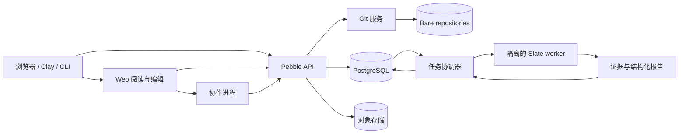

# Pebble 技术研究与实现方案

记录：TECH-0001；状态：proposed；研究日期：2026-09-08。

本方案细化 [产品设计](product-architecture.md)。外部组件能力来自所链接的官方资料；选型、接口和资源目标是 Pebble 的建议。尚未部署服务或完成端到端验证。Slate 的具体核查与包协议见 [包管理及验证边界](package-verification.md)。

## 1. 建议技术组合

| 部分 | 建议 | 原因与替代方案 |
| --- | --- | --- |
| Web | TypeScript、React、Next.js | 论文/结果页服务端渲染，编辑器客户端交互；纯 SPA 可行，但需额外处理公开阅读页渲染 |
| 应用 API | TypeScript、Fastify，模块化单体 | Web、CLI、Clay 共用明确 HTTP API；业务授权和发布事务只在这里实现，不在 Next Server Actions 再写一套 |
| 数据 | PostgreSQL、显式 SQL migrations | 关系、唯一性和发布事务是主要需求；证明 DAG 原始体不塞进关系表 |
| Git | 独立 Git 服务，调用原生 Git plumbing 和 smart HTTP backend | 复用 Git 协议；Pebble 管身份、议题和研究审阅；先 HTTP，SSH 在同一授权协议成熟后接入 |
| 文件 | S3 API 对象存储，Git 使用独立持久卷 | 包、证据、数据及导出文件走对象存储；不把 bare Git 仓库目录直接放对象存储 |
| 写作 | ProseMirror 文档模型 + Yjs 协作 | 结构化公式和结果引用；支持在线多人编辑，提交时导出稳定 Markdown 子集 |
| 检索 | PostgreSQL 全文索引、精确标识索引 | 先测结果检索质量与权限过滤；语义向量搜索增量加入，不直接上独立图数据库 |
| 异步执行 | PostgreSQL job/outbox 表 + 独立 worker | 发布状态与入队可在一次事务中提交；目前没有引入 Kafka/Temporal 的已测需求 |
| 验证执行 | 固定 Slate 工具链镜像、隔离 worker | 验证进程不能持有项目写权限、发布凭据或模型 API key |

Next 支持服务端与客户端组件分工；Fastify 提供 schema 验证/序列化，但其 schema 必须来自服务端受控代码，不能把用户提交的 schema 动态编译执行。[Next 文档](https://nextjs.org/docs/app/getting-started/server-and-client-components)、[Fastify 文档](https://fastify.dev/docs/latest/Reference/Validation-and-Serialization/)。

这是基于产品需求的选型推论，不是性能排名。Rust 留在 Slate 客户端和检查器；网页业务首版不增加第二套 Rust API 服务。各具体依赖版本在脚手架阶段按兼容性测试锁定，不把文档中滚动的 latest 当部署版本。



逻辑模块不等于独立微服务。Web、API、协作进程可来自同一 TypeScript workspace；Git 与验证单独运行是因为文件权限和执行隔离不同。

建议仓库布局如下，当前只创建了设计文档和有限实验，尚未创建这些应用目录：

```text
apps/web/                  页面、阅读与编辑
apps/api/                  身份、项目、协作、注册、发布等业务模块
apps/worker/               任务协调、索引与导出
apps/collaboration/        Yjs 连接、持久化和 checkpoint
packages/api-contracts/    单一 API schema 与生成客户端的输入
packages/document/         文稿 schema、解析、序列化和结果引用
services/git/              Git gateway/backend 适配与运维
infra/                     部署、隔离执行配置与恢复流程
```

目录边界不是要求各建一个微服务。数据库迁移由 API 所属应用统一管理，禁止 worker 或页面直接引入各自版本的发布规则。

## 2. Git：复用什么，自己做什么

### 方案比较

| 路线 | 能复用 | Pebble 必须额外承担 | 结论 |
| --- | --- | --- | --- |
| GitHub 托管用户研究 | Git、PR、身份生态 | 外部可用性/权限依赖、平台访问与研究记录权限映射 | 支持导入或镜像，不作为唯一研究存储 |
| Forgejo 作完整底座 | Git、议题、PR、账户、API | 两套产品对象/权限/事务的同步，或长期维护 UI/服务分叉 | 认真保留为备选，未做部署比较，不宣称它不能满足 |
| 原生 Git 服务 + Pebble 数据模型 | Git 传输、对象、diff、merge、ref 事务 | 托管运维、分支保护、审阅、权限、限额、备份均由我们负责 | 当前推荐，因研究结果与文稿审阅是核心业务 |

Forgejo 提供 REST API 和实例 OpenAPI 文档，适合做有限适配；API 存在本身不保证 Pebble 的跨系统发布原子性。原生 `git-http-backend` 提供 fetch/push HTTP 协议，认证授权仍需服务器负责。[Forgejo API](https://forgejo.org/docs/latest/user/api-usage/)、[Git HTTP backend](https://git-scm.com/docs/git-http-backend)。

在进入完整托管实现前做一个有退出条件的比较：同样演示私有项目 clone/push、撤权、受保护分支、网页提交、结果审阅链接和恢复备份。若 Forgejo 适配在不分叉内核、不复制授权真相的情况下显著减少维护，则替换 Git 服务建议；不要同时生产运行两套托管后端。

### 数据与协议

每个项目一个 bare repository，以不可变 `project_id` 定位磁盘目录；用户输入的 owner/slug 只查映射，不能拼进文件路径或 shell。对象读取使用 `git cat-file --batch`，树枚举用 `git ls-tree -z`，避免每个文件启动一个进程；所有 Git 子进程用固定 argv、受控环境和超时。

HTTP gateway 校验短期/可撤销 token，生成绑定 project、操作、权限修订和请求 ID 的内部授权。Git backend 不公开监听，只接收受控 gateway 的请求；仓库级读权限作用于整个对象库。push 在平台控制的 receive hook 再检查权限和保护规则；禁止用户安装服务器 hook，用户仓库内的文件不成为 hook。导入 URL 的网络访问与构建隔离，限制协议、重定向和内网地址。

**不支持公开项目的“私有分支”。** Git 官方明确指出 namespace 不是读取权限隔离边界。私有研究应放另一个私有项目/仓库；公开对话也不靠隐藏 Git ref 实现。公开发布可来自私有项目，但只导出明确选定的发布内容，不公开 Git 历史或研究记录。[Git namespace 安全说明](https://git-scm.com/docs/gitnamespaces)。

网页提交与 agent 补丁必须携带 `expected_head`。服务端生成新 tree/commit 后，以 `git update-ref REF NEW OLD` 比较并更新；过期 head 返回冲突，不覆盖新提交。PR 审阅绑定 `base_oid`、`head_oid` 和候选合并树，目标分支变化时使旧合并检查失效。[Git ref 更新](https://git-scm.com/docs/git-update-ref)。

Git 与 SQL 无共同事务：先建立含 operation ID 的 SQL 操作记录，Git 侧更新目标 ref 并记录操作完成标识，再由幂等 reconciler 完成 SQL 投影。系统不得在 ref 更新成功、SQL 写入失败后再次无条件提交。发布固定候选 ref 及内容包；分支移动、删除不会改变已选候选。Git 内多个 ref 可事务更新，但这不解决 Git/SQL 的跨存储原子性。

### 已做的有限实验

[`experiments/git_snapshot.py`](../experiments/git_snapshot.py) 用临时 bare repository 检查三项真实 Git 行为：过期 head 的写入拒绝、候选 ref 不随分支移动、失败多 ref 事务没有部分更新。它不测试 HTTP、授权、SQL、编辑器或网络并发；结果不能替代托管集成测试。

2026-09-08 本地以 Git 2.51.0 运行，三项检查均通过。可用 `python3 experiments/git_snapshot.py` 重现；临时仓库自动清理，不连接远程。

## 3. 写作：文稿、CRDT 和 Git 的精确关系

### 每一层的唯一职责

| 层 | 内容 | 权威范围 |
| --- | --- | --- |
| 在线草稿 | Yjs updates、服务端序列号、快照、协作 epoch | 当前编辑会话的草稿，不是已提交论文 |
| Git 修订 | `paper.md`、来源代码、固定数据引用 | 已提交研究快照，可审阅与导出 |
| 发布 | 特定 Git 修订 + 包快照 + 验证记录 | 正式对外版本；后续编辑不改变它 |

ProseMirror 提供文档模型，Yjs 有 ProseMirror binding；Yjs 更新可合并，具有可交换、可结合和幂等属性，但不提供业务权限或 Git 合并策略。[ProseMirror model](https://github.com/prosemirror/prosemirror-model)、[Yjs binding](https://docs.yjs.dev/ecosystem/editor-bindings/prosemirror)、[Yjs updates](https://docs.yjs.dev/api/document-updates)。

草稿按 `(project_id, branch_id, document_id, epoch)` 分房间；每次 update 验证当前写权限，持久化后再确认已保存。Awareness/光标是临时状态，不记录为研究贡献。撤权断开会话并拒绝随后到达的 updates；只在连接时鉴权不足够。

Checkpoint 流程：服务端确定已持久化 update 截止序号 → 构造该时刻草稿 → 校验文档 schema → 确定性导出 Markdown → 以 `expected_head` 提交 Git → 记录 checkpoint 与新 head。截止后更新保留为下一份草稿，不因 checkpoint 丢失。离线未送达的更新不包含在当前发布候选内，界面要清楚提示。

外部 Git push 修改同一文稿时，不把整篇新文本直接写入现有 Yjs 状态。把当前草稿先导出到独立分支，与共同基线做三方合并；解决冲突后开启新 epoch，保留旧草稿可恢复。不能把 Git merge 与 CRDT merge 当作同一个操作。

### 文稿格式

选择一个可逆的 Markdown 子集：标题、段落、列表、表格、代码块、LaTeX 公式、参考文献及 `result_ref` 节点。结果引用的编辑器节点保存稳定 `result_id` 和精确 release/declaration binding，显示名由服务器解析；不是用户手写的“已验证” badge。

普通 Git 用户可直接编辑文稿。解析到不支持的扩展时保留原文块并提示，不做静默丢弃。第一轮编辑器实验必须验证 Markdown → 文档树 → Markdown 往返、公式/引用保留、混合中文、离线重连、两个协作者同时改同一引用。

结果展示与原文切分同源：公式 LaTeX 只作为显示内容，不运行 TeX shell；不在应用进程执行用户 MDX/JavaScript。导出 PDF 的 TeX/渲染任务在隔离 worker 内运行。

草稿批注使用 Yjs relative position；提交审阅批注绑定 commit、文件、结构节点/范围以及摘录。Yjs 可以把相对位置映射回当前文档位置，但节点删除时不能保证仍有有效位置，应显示过期。[Yjs relative positions](https://docs.yjs.dev/api/relative-positions)。

## 4. 数据模型与事务约束

以下是逻辑表，不是已经执行的 migration。大对象以摘要引用存储，授权判断依靠关系表。

| 表 | 主要字段与关键约束 |
| --- | --- |
| `principals`, `external_identities` | 用户/组织稳定 ID；外部身份唯一 `(issuer, subject)`，邮箱不作为唯一身份凭据 |
| `projects`, `memberships` | project ID、slug、visibility、ACL revision；唯一 `(project_id, principal_id)` |
| `repositories`, `git_operations` | project→repo 映射，Git 操作 ID、expected/new OID、状态 |
| `documents`, `document_updates`, `checkpoints` | 文档 schema、epoch、单调序号、Git 基线和 checkpoint commit |
| `packages`, `package_versions` | 稳定 package ID、owner、slug；唯一 `(package_id, version)`，正式内容不可 UPDATE |
| `release_candidates`, `releases` | 固定修订、包集合、manifest digest、审核记录、状态修订 |
| `verification_runs`, `verification_results` | input digest、工具链/政策、attempt、状态、报告对象；结果按精确声明绑定 |
| `results`, `result_revisions` | 人类延续性 result ID；精确版本声明/命题/闭包身份；跨版本关联由作者提出并可审阅 |
| `dependency_edges`, `citations` | 前者绑定包/模块/声明实际依赖；后者保存科学引用；不混成一种边 |
| `issues`, `pull_requests`, `reviews`, `comments` | 固定审阅修订和目标对象，正文可编辑并留历史 |
| `follows`, `bookmarks`, `activity_events`, `notifications` | 唯一关注关系、幂等事件 ID、每用户读取状态 |
| `research_records`, `source_permissions`, `training_choices` | 记录/片段来源、权利及选择的生效时间，不继承 Git 的公开权限 |
| `dataset_exports`, `export_items`, `evaluation_exclusions` | 导出清单、每项授权快照、问题族排除及撤销状态 |
| `challenges`, `submissions`, `contribution_credits` | 固定问题/validator 修订、用途隔离、提交来源与验证状态；署名不只限获胜者 |
| `jobs`, `outbox_events`, `idempotency_keys` | 任务租约/attempt、投递标记、作用域内请求摘要与返回结果 |

包注册命名允许 `@owner/name`，底层稳定 ID 不随组织转移改变。发布版本先禁止 build metadata，避免同一 SemVer 排序位置却有两个身份；预发布版本仅显式选择。不同包导出同一 Slate ModuleId 是否可共存由精确图检查决定，不由名称表单检查决定。

发布事务锁定候选和涉及的 package 行，复查内容摘要、当前发布者权限、检查/审核绑定、依赖撤销状态及当前政策；插入所有 package_versions、release 与 outbox 后一次提交。任何一个包版本冲突则整个发布不生效。发布者撤权、包转移和政策更新也使用相同的版本/锁协议，避免检查与提交之间更换授权。

只支持追加撤回/验证撤销事件，不修改已发布内容。对象存储准备成功但数据库失败的对象是不可见孤儿，按保留期回收；数据库不得先发布再慢慢上传证据。

## 5. 任务执行与验证吞吐

`jobs` 记录 `kind, input_digest, attempt, lease_owner, lease_until, available_at, state`。Worker 用短事务领取任务，执行过程中续租，不持数据库锁。PostgreSQL 的 `FOR UPDATE SKIP LOCKED` 适合多消费者队列表，但它返回不一致视图，不应用于证明“所有发布检查齐备”。[PostgreSQL SELECT](https://www.postgresql.org/docs/current/sql-select.html)。

任务语义是至少一次；回传必须匹配当前 attempt/租约和 input digest。过期 worker 的成功不能覆盖新结果。Outbox 投递、索引和通知按 event ID 去重。重试政策区分基础设施错误、超时和确定性检查失败；超时不能投影成数学反例。

验证流水线分为受控准备、隔离构建/检查、结果收集及提交。下载由准备阶段按锁文件完成，执行阶段默认无网络；供应只读源码/依赖/工具链，独立临时空间，限制 CPU、内存、磁盘、进程和输出体积。禁止挂 Docker socket、宿主凭据和共享可写信任缓存。

推荐首先测试 gVisor 下的现有 Slate 工具链与 filesystem/process 调用；若存在不支持的调用或隔离/吞吐不达标，再测试 Firecracker microVM。前者提供用户态应用内核隔离，后者采用基于 KVM 的 microVM；这些机制不产生数学证据，也不保证所有工具都能直接运行。[gVisor 架构](https://gvisor.dev/docs/architecture_guide/intro/)、[Firecracker](https://firecracker-microvm.github.io/)。

分离不可信 producer 与决定接受的受控检查进程。用户能在同一可写身份下运行任意代码时，即使检查器本身正确，也不能让该身份写检查完成记录或注入 stdout。发布凭据只在协调器；它接受绑定当前任务的受控报告，不接受作者上传的同形 JSON。

容量先按假设算，再实测：若每天 1,000 次检查、平均每次消耗 600 CPU 秒，平均需求约 `1000×600/86400 = 6.94` 核；按 50% 利用率约 14 核。这个数不含尖峰、内存、I/O、重试和不可并行部分，不是机器采购结论。记录排队/准备/检查/存储分别耗时以及峰值 RSS，按实际长尾调并发，不能只看任务数。

## 6. 搜索、引用与社交数据流

索引单位是项目、论文和精确结果三个层次。结果文档包含标题、作者、领域、自然语言说明、声明词项、符号/定义 ID、理论及假设摘要、包版本、当前验证状态。依赖邻接表用于“哪些结果依赖它”，点击展开逐页查，不预先保存所有路径。全图巡检按节点与边去重，避免菱形依赖指数展开。

先用精确 ModuleId/FactId 查找、前缀/词项检索和 PostgreSQL 全文 GIN 索引。GIN 是官方建议的全文搜索索引类型；这不意味着内建词典已经解决中文分词或数学公式检索。[PostgreSQL 文本索引](https://www.postgresql.org/docs/current/textsearch-indexes.html)。

评测集从真实研究任务整理：精确符号、同义描述、中文/英文、带假设限制、找前置引理。测 top-k 命中与误导性推荐；向量召回只是候选排序，不能判断某命题可由另一个命题推出。向量数据也继承项目读取限制。

权限过滤必须发生在检索及计数层，并在读完整对象时复查；不能先泄露私有标题、命中总数或相似片段，再对正文返回 403。数据库运行角色不使用 owner/superuser/BYPASSRLS；若采用 RLS，明确 FORCE RLS、连接池事务上下文和外键错误信息处理。RLS 并不能替代对象存储、Git 和 WebSocket 的授权。[PostgreSQL RLS](https://www.postgresql.org/docs/current/ddl-rowsecurity.html)。

引用落点先提供稳定 Pebble URL、BibTeX/CSL-JSON 导出和版本关系。DOI 注册/版本策略需另行核查对接机构，不能因为本地生成字符串就宣称已有 DOI。结果改名保留跳转；撤回显示墓碑及替代结果。社交 feed 从 outbox 事件投影，首版读时聚合关注对象，避免每次热门发布同步写百万收件箱；索引 `(actor_id, created_at, id)`，游标翻页且逐次检查可见性。

## 7. 权限、文件下载与训练导出

角色建议：viewer、contributor、maintainer、owner；审稿者的审核结论权不等于项目写权限。发布、转移、删项目、训练选择分别是明确 action。Agent 使用有过期时间且绑定项目/动作的 token，不能凭“AI 发起”绕过真人同样的检查。

对象内容摘要不是访问令牌。私有下载先授权，再给短时、限对象的 URL，严格保密下载可走逐请求授权代理。S3 presigned URL 是 bearer token，撤权不自动保证已发出的 URL 立刻失效；产品必须明示短时有效窗口，不能承诺瞬时收回已下载的数据。[S3 presigned URLs](https://docs.aws.amazon.com/AmazonS3/latest/userguide/using-presigned-url.html)。

上传到隔离 staging key，服务器校验长度、摘要和内容清单后才转为可引用对象；不以 ETag 泛指 SHA-256。研究记录、BYOK 密钥和构建日志不能默认进入公开包。公开 HTML/PDF/附件域与登录应用隔离，渲染进行内容清理。

训练贡献按原始愿景默认开启，但建项目、开会话和贡献设置处重复提醒。每次导出按材料片段检查记录时的选择和当前可用授权，生成固定清单；待导出材料退出后不进入新导出，已交付/已训练材料的处理策略另行明确。免费额度资格由独立服务计算，不在下载授权中混入“愿不愿训练”。

BYOK 输出只在允许训练的来源规则下进入清单；没有权限信息则暂不导出。协作者贡献与第三方粘贴内容分别记录来源，项目 owner 开关不替代必要的授权。活跃评估题及其变体/问题族有硬性排除标记；人工审核语义重叠仍必要，简单文本 hash 去重不足够。

## 8. 首个实现闭环与需要证明的事情

建议先按下面的依赖顺序开发，不按“先把所有页面画完”组织：

1. **Slate adapter 实验**：真实模块、声明清单、完整检查覆盖和结构化导出；证明漏一个文件、依赖替换、开发假设或普通 run 成功都不能发布。
2. **项目与 Git**：账户映射、私有项目 clone/push、网页 CAS 提交、备份恢复；用 Forgejo 做同一工作流的有界对照再冻结托管决定。
3. **包到发布**：固定候选、锁定依赖、隔离检查、审核和事务发布；第三台干净环境从下载源码重建并检查一个依赖它的新结果。
4. **论文与结果页**：可引用、可展开假设/依赖、读写往返；关联精确结果，不编造新声明与旧证据的联系。
5. **协作与社交**：PR、审阅、关注、通知、实时文稿；并发提交与撤权测试先于放开多租户。
6. **训练导出与竞赛**：完整来源/选择/评估隔离链落地，再向训练系统开放数据。

要先测的高风险点：Git/SQL 断点恢复、双 worker 回传、发布与撤权并发、实时草稿遇到外部 push、私有依赖泄漏、Slate 同名模块版本冲突。每项用能区分设计是否成立的实验，不用空壳 API 或模拟验证成功交差。

初始部署建议单区域、多进程，数据库和 Git/对象存储都有可恢复备份；验证节点独立扩容。恢复演练检查数据库发布记录所指对象与 Git pin 都仍存在，不能只证明数据库备份能打开。API p95、协作 ack、搜索质量、队列延迟的目标在真实负载基线后冻结；当前没有产品压测结果。
